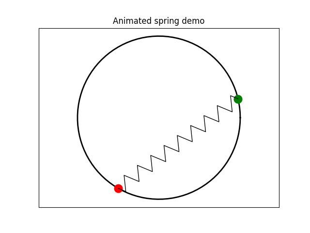
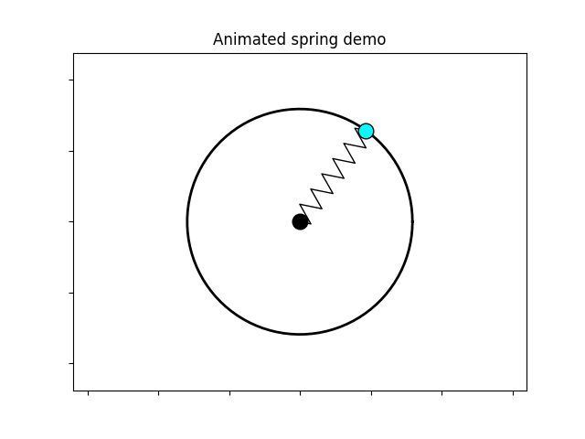
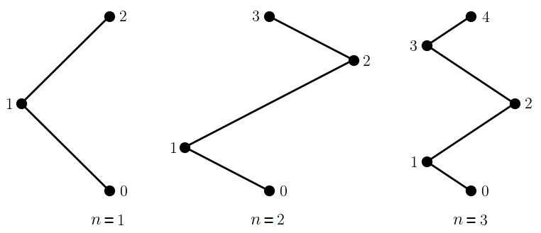
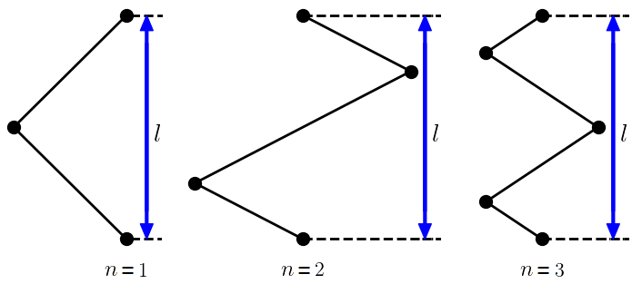
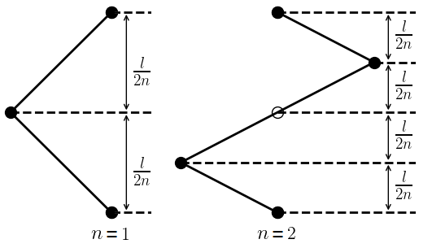
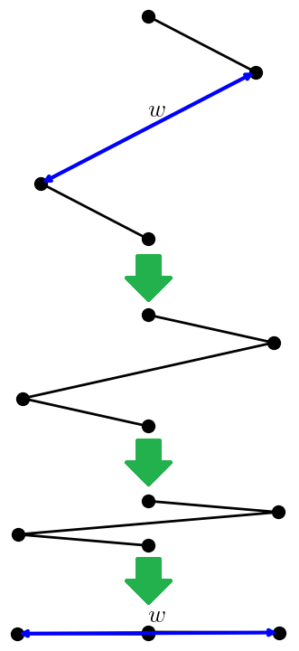
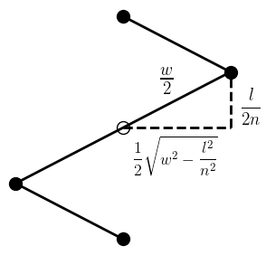
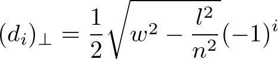
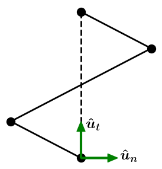
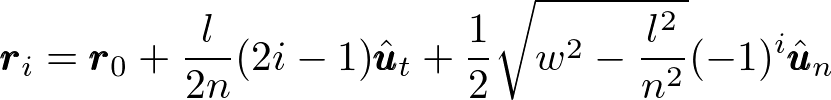

# Spring

* [Usage](#usage)
* [Example](#example)
* [Background](#background)

*spring.py* returns a list of x coordinates and a list of y coordinates
corresponding to the "nodes" of a sawtooth-shaped spring given two endpoints
located anywhere in 2-dimensional space, making it easy to dynamically plot
a spring.

<a href="https://youtu.be/Y70-afmGeh4">
  <span float="left">
    
    
  </span>
  <p float="center">
    Click here to watch a video of a script that
    uses spring.py to animate a spring stretching and compressing
</p>
</a>

See the sections below or
<a href="https://nrsyed.com/2018/10/07/a-function-for-plotting-a-2d-spring/">
this blog post</a> for a more detailed explanation.

# Usage

`x_coords, y_coords = spring(start, end, nodes, width)`

### Parameters

**start**: *array-like*

A container or iterable with two elements representing the x and y coordinates
of the first endpoint.

**end**: *array-like*

A container or iterable with two elements representing the x and y coordinates
of the second endpoint.

**nodes**: *integer*

The number of nodes *n*. *n* ≥ 1. Defaults to 1 if a number less than 1 is
provided.

**width**: *float*

The width *w* of the spring. If *w* is not large enough for the distance
between the endpoints (<a href="#min_width">see below</a>), it will be
adjusted automatically and the spring will simply be displayed as a line.

### Returns

**x_coords, y_coords**: *list, list*

Two lists containing the x coordinates and y coordinates, respectively, of
the spring nodes, including the endpoints. This makes it easy to feed the
output of the function directly to methods in matplotlib.

# Example

```python
import matplotlib.pyplot as plt
from spring import spring

point_a = (1, 1.5)
point_b = (8.1, 6)

fig, ax = plt.subplots()
ax.plot(*spring(point_a, point_b, 12, 1.2), c="black")
ax.set_aspect("equal", "box")
plt.show()
```

# Background

The number of nodes between the two endpoints is defined as *n*, with the
nodes being numbered from 0 (first endpoint) to *n+1* (second endpoint):



The length of the spring, i.e., the distance between the two endpoints, is 
defined as *l*, illustrated by the following figure:



Then, for any number of nodes *n* and length *l*, the "straight-line"
distance between nodes can be obtained from the following pattern (only *n=1*
and *n=2* are shown below):



Expressed mathematically, the distance of the *i*th node along (parallel to)
the centerline between the two endpoints is


for 0 < *i* < *n+1*. Next, I define the width *w* as the length of one "link"
in the spring, based on the idea that this would be its width if it were
fully compressed:



Then the perpendicular distance of a node from the imaginary centerline
connecting the endpoints is found as follows:



Accordingly, the perpendicular distance of the *i*th node can be expressed
as follows:



<a name="min_width"></a>
for 0 < *i* < *n+1*. Observe that the spring can attain a maximum length of
*nw*, at which point the nodes would be collinear, i.e., the spring would
be a straight line. If *l > nw*, the quantity in the square root will be
negative, indicating that the spring cannot physically stretch to the
desired length.

Finally, the unit tangent and unit normal vectors are computed
(tangent/parallel to and normal/perpendicular to the imaginary centerline
between the endpoints, respectively), allowing the node coordinates to be
easily obtained for endpoints located anywhere in the xy plane.



Putting it all together, the location of the *i*th node relative to the
first endpoint (node 0) is given by the following equation:


